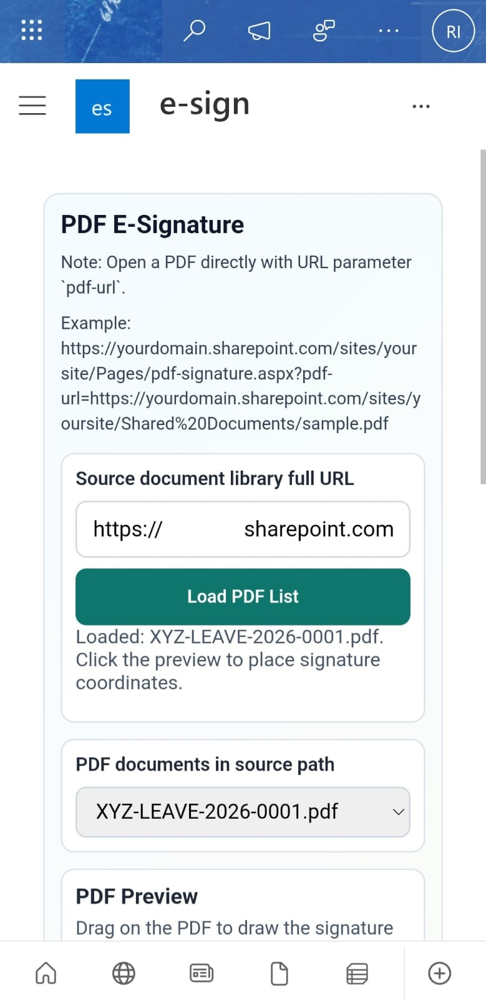
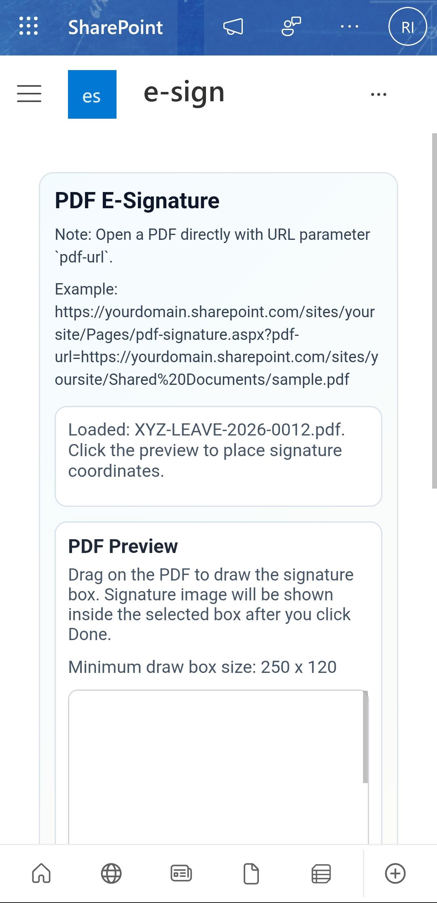
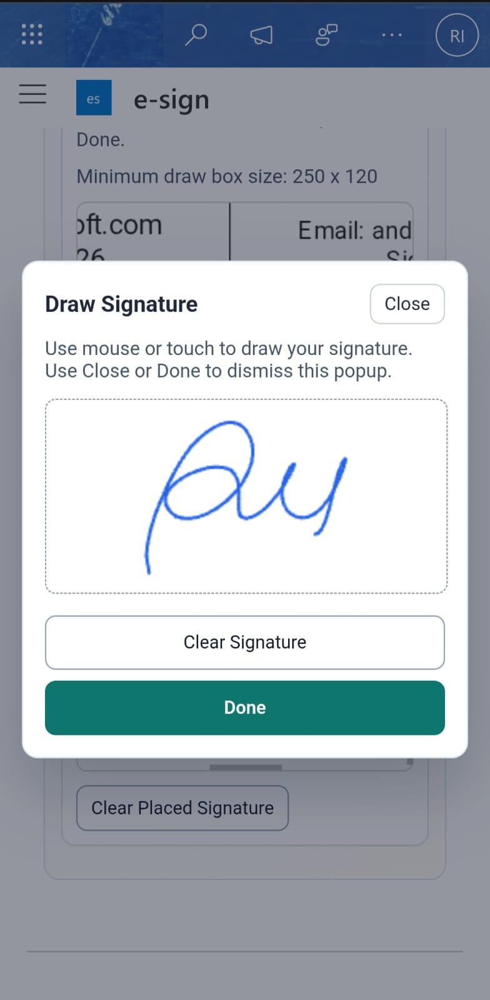
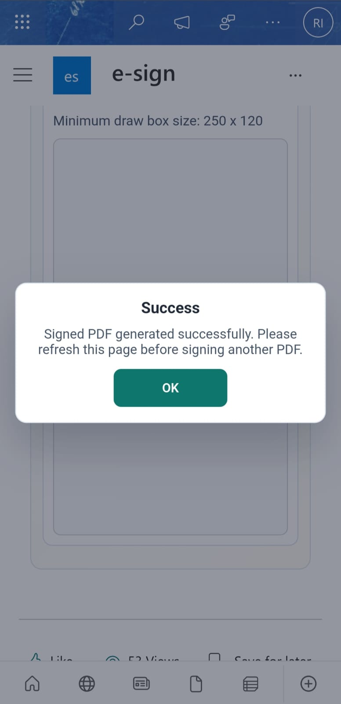
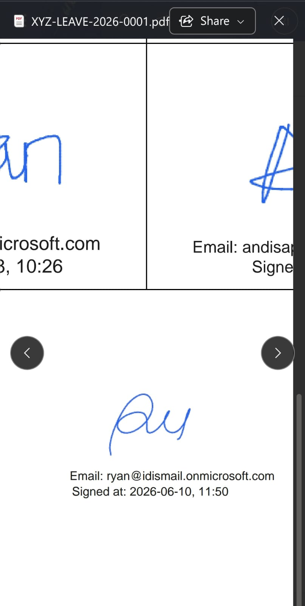

# SPFX Custom Dynamic Signature

SPFx web part for signing PDF files stored in SharePoint document libraries.<br/>
This SPFx package allows users to draw signatures directly on PDF documents and save the signed PDF to a specified location within your SharePoint tenant.<br/>
You can build this spfx package to your SharePoint tenant.<br/>
Visit https://{yourtenant}.sharepoint.com/sites/AppCatalog/SitePages/Beranda.aspx to check SharePoint Store.

# How to deploy
1. Download the spfx-dynamic-signature.sppkg package from the /build folder.<br/>
[spfx-dynamic-signature.sppkg](https://github.com/ryanisml/spfx-dynamic-signature/blob/main/build/spfx-dynamic-signature.sppkg)<br/>
After downloading the package, open the SharePoint App Catalog URL.<br/>


2. Upload the package to the SharePoint App Catalog: https://{tenant-name}.sharepoint.com/sites/appcatalog/_layouts/15/tenantAppCatalog.aspx
Then enable the app<br/>


3. Add the PDF E-Signature web part to a SharePoint page.<br/>


4. Republish the page<br/>

<br/><br/>

# Screenshot for Desktop

1. Open https://make.powerautomate.com/ create new power automate. create new flow, i have created "Request Signature to Person Selected"<br/>
Screenshot showing how to create a new flow in Power Automate with conditional logic.<br/>


2. After that, return to your flow details page and copy the Flow ID from the URL: https://make.powerautomate.com/environments/{your-environment-id}/flows/{flow-id}/details.<br/>Screenshot showing how to create a new Power Automate action from the document properties menu as a custom button.<br/>


3. Screenshot showing how to add a selected item to a new dropdown option named "Request New E-Signature".<br/>


4. Screenshot showing the user clicking the "Request Signature" button.<br/>


5. Screenshot of the email notification generated after the custom Power Automate flow is executed.<br/>


6. Screenshot of the PDF preview page with the URL parameter (pdf-url) provided.<br/>


7. Screenshot of the PDF preview page without the URL parameter.<br/>


8. Screenshot showing how to draw a signature on the popup signature canvas.<br/>


9. Screenshot showing the PDF preview after the signature has been drawn.<br/>


10. Screenshot showing the completed PDF signature after clicking the "Generate Signature" button.<br/>


11. Screenshot showing the document approval location after the document has been updated.<br/>


12. Screenshot showing the signed PDF document after it has been opened.<br/>


<br/><br/>

# Screenshot for Mobile
1. Screenshot of the PDF E-Signature web part showing a PDF preview with signature placement and metadata stamping.<br/>


2. Screenshot of the PDF E-Signature web part showing a PDF preview loaded from the pdf-url parameter.<br/>


3. Screenshot showing the signature drawing canvas displayed in a popup modal.<br/>


4. Screenshot showing the notification displayed after the e-signature process is completed.<br/>


5. Screenshot showing the PDF preview after the document has been signed by the user.<br/>


## What This Solution Does

The web part lets users:

1. Load PDFs from a SharePoint library path.
2. Open a PDF preview and drag to choose signature coordinates.
3. Draw a signature in a popup canvas.
4. Automatically capture signer email (from current SharePoint user profile).
5. Stamp signature image + metadata on the PDF:
   - Email: <value>
   - Signed at: yyyy-MM-dd, HH:mm
6. Save signed PDF to a destination library path.

Upload behavior:

- The signed PDF overwrites the selected source file name in the chosen destination folder.
- If destination is the same folder as source, the original selected file is replaced.

## Current User Flow

1. Enter source document library full URL, then click Load PDF List.
2. Pick a PDF from the list.
3. Drag on preview to select placement area.
4. Draw signature in modal, then click Done.
5. Choose destination behavior:
   - Use same destination path as source, or
   - Enter a different destination library URL.
6. Click Generate Signed PDF.

Notes:

- After clicking Done in the signature popup, preview placement is locked.
- Click Clear Placed Signature to unlock and re-select placement.

## Direct PDF URL Parameter Mode

The web part supports opening a PDF directly by URL parameter.

Accepted query parameter:

- pdf-url

Example:

```text
https://<tenant>.sharepoint.com/sites/<site>/SitePages/PdfESignature.aspx?pdf-url=https%3A%2F%2F<tenant>.sharepoint.com%2Fsites%2F<site>%2FShared%20Documents%2FExample.pdf
```
or 
```text
https://<tenant>.sharepoint.com/sites/<site>/SitePages/PdfESignature.aspx?pdf-url=https://<tenant>.sharepoint.com/sites/<sitename>/Shared Documents/Example.pdf
```

Behavior:

- If parameter is valid and file exists: direct mode opens that file.
- If parameter is invalid or file is missing: app falls back to normal source library flow.

## Tech Stack

- SharePoint Framework 1.22.2
- React 17
- TypeScript 5.8
- pdf-lib (PDF writing/stamping)
- pdfjs-dist (PDF preview rendering)

## Prerequisites

- Node.js >= 22.14.0 and < 23.0.0
- Microsoft 365 tenant with SharePoint
- Permission to read source library and write destination library

## Configuration

This project uses dotenv-cli for local start.<br/>
> **Please note that this step is required only for local development. It is not needed in a production environment.**

1. Copy .env.example to .env.
2. Set tenant domain value:

```env
SPFX_SERVE_TENANT_DOMAIN=<your-tenant>.sharepoint.com
```

The local workbench URL is configured in config/serve.json with:

- https enabled
- initialPage: https://{tenantdomain}/_layouts/workbench.aspx

## Run Locally

```bash
npm install
npm start
```

`npm start` runs:

```bash
dotenv -e .env -- heft start --clean
```

## Build and Package

```bash
npm run build
```

`npm run build` runs production build + package:

```bash
heft test --clean --production && heft package-solution --production
```

Output package is generated for SharePoint app catalog deployment in the standard SPFx package output location.

## Important Implementation Notes

- The web part uses SharePoint REST via SPHttpClient.
- It does not call Microsoft Graph.
- Timestamp format is fixed in code as yyyy-MM-dd, HH:mm (utc + 7).
- Metadata order below signature is:
  - Email (first line)
  - Signed at (second line)

## Scripts

- npm start: run local debug session with dotenv + heft
- npm run build: production build + solution packaging
- npm run clean: clean artifacts
- npm run eject-webpack: eject webpack config

## License

Internal project use unless your organization defines otherwise.